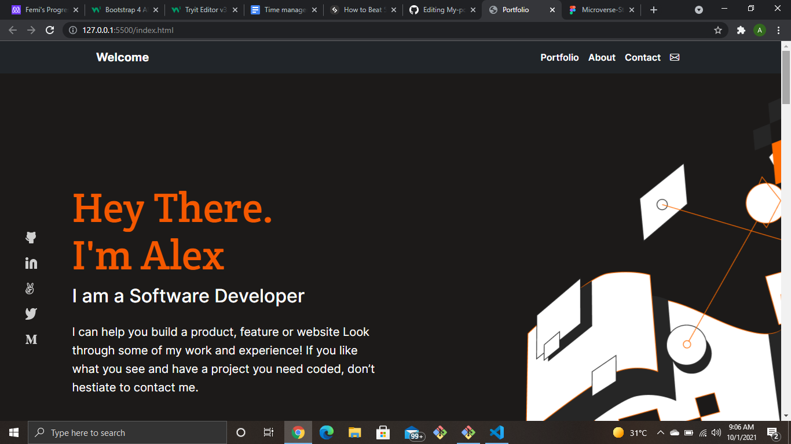

# Bootstrap Portfolio

> Creating a website using bootstrap.

.

## Built With

- HTML
- CSS

## Getting Started

> To get a local copy follow the following steps:

- Copy this link https://github.com/farouqdaif1/bootstrap-portfolio.git
- Open your terminal or command line
- Run git clone and paste the link
- Open the folder with your code editor
- Create a branch to work on

## Authors

👤 **Awoyemi Oluwafemi**

- GitHub: [@phelian23](https://github.com/phelian23)

👤 **Farouq Daif**

- GitHub: [@farouqdaif1](https://github.com/farouqdaif1)

## 🤝 Contributing

Contributions, issues, and feature requests are welcome!

Feel free to check the [issues page](../../issues/).

## Show your support

Give a ⭐️ if you like this project!

## Acknowledgments

- Hat tip to anyone whose code was used
- Inspiration
- etc

## 📝 License

This project is [MIT](./MIT.md) licensed.